## Reza Tariki Taser
## TI.20.A2
## 312010265
## Pemrograman Web

Sebelum memulai menggunakan Framework Codeigniter, perlu dilakukan konfigurasi
pada webserver. Beberapa ekstensi PHP perlu diaktifkan untuk kebutuhan
pengembangan Codeigniter 4.
Berikut beberapa ekstensi yang perlu diaktifkan:
• php-json ekstension untuk bekerja dengan JSON;
• php-mysqlnd native driver untuk MySQL;
• php-xml ekstension untuk bekerja dengan XML;
• php-intl ekstensi untuk membuat aplikasi multibahasa;
• libcurl (opsional), jika ingin pakai Curl.

## 1.mengaktifkan ekstentsi tersebut, melalu XAMPP Control Panel, pada bagian Apache klik Config -> PHP.ini

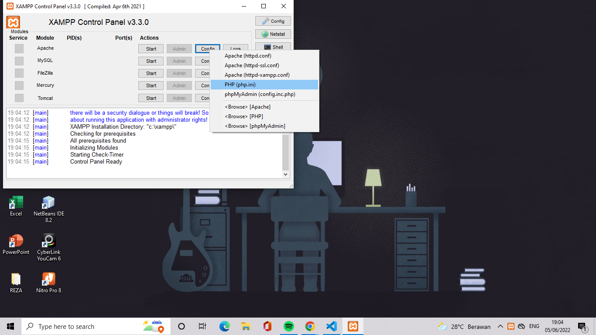
Pada bagian extention, hilangkan tanda ; (titik koma) pada ekstensi yang akan
diaktifkan. Kemudian simpan kembali filenya dan restart Apache web server.

## 2. Instalasi Codeigniter 4
Untuk melakukan instalasi Codeigniter 4 dapat dilakukan dengan dua cara, yaitu cara
manual dan menggunakan composer. Pada praktikum ini kita menggunakan cara
manual.
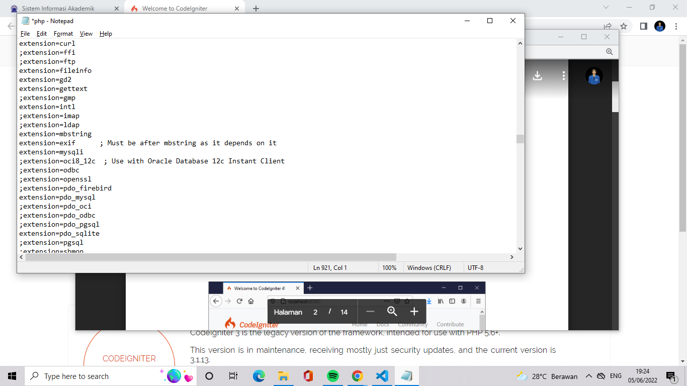
Aktifkan beberpa extension seperti contoh di atas

## 3. KEMUDIAN BUAT FOLDER BARU DENGAN NAMA lab11_php_ci
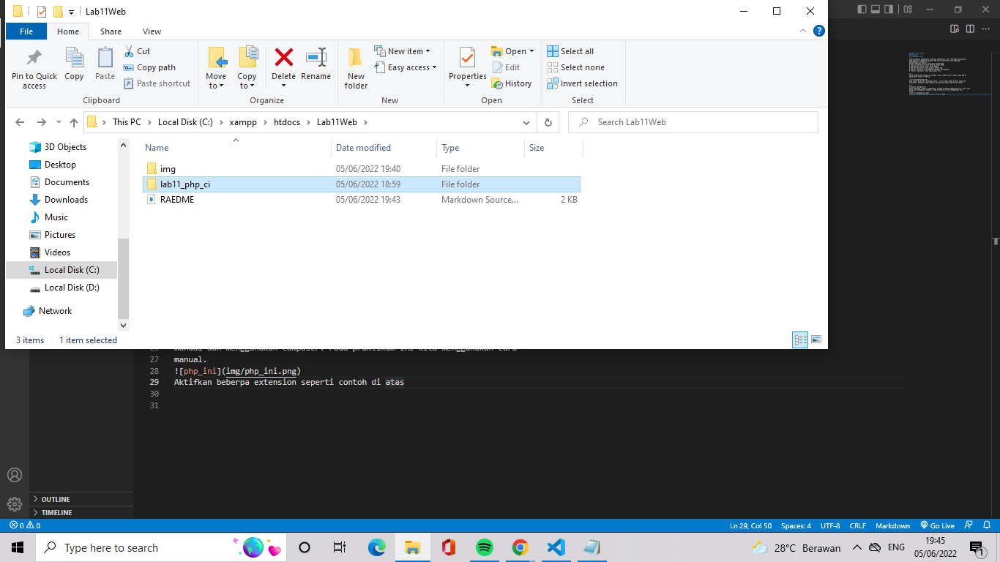
membuat folder seperti diatas 

## 4. INSTALASI CODEIGNITER 4
Untuk melakukan instalasi codeigniter 4 dapat dilakukan dengan dua cara , yaitu cara manual dan menggunakan composer. pada praktikum ini kita menggunakan cara manual.

Unduh Codeigniter dari website https://codeigniter.com/download
Extrak file zip Codeigniter ke directori htdocs/lab11_ci.
Ubah nama direktory framework-4.x.xx menjadi ci4
Buka browser dengan alamat http://localhost/Lab11Web/lab11_php_ci/ci4/public/
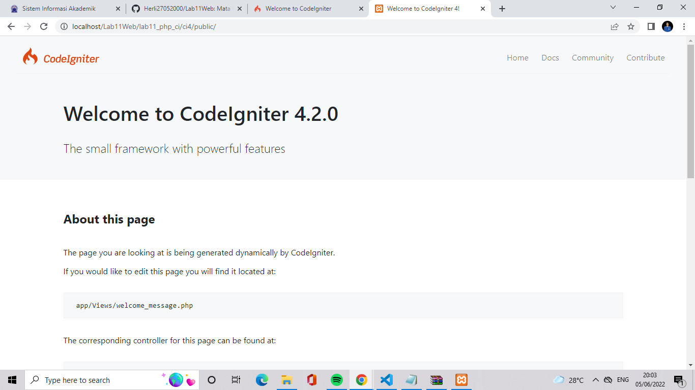
Codeigniter berhasil didownload dan disimpan file ekstrak nya

## 5. MENJALANKAN CLI (Command Line Interface)
Codeigniter 4 menyediakan CLI untuk mempermudah proses development. Untuk mengakses CLI buka terminal/command prompt.
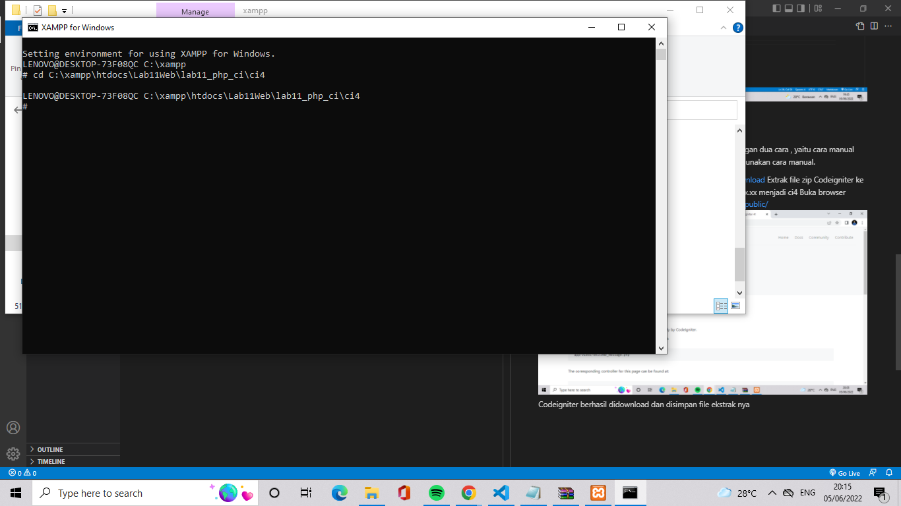
Arahkan lokasi direktori sesuai dengan direktori kerja project dibuat (C:\xampp\htdocs\Lab11Web\lab11_php_ci\ci4)
Perintah yang dapat dijalankan untuk memanggil CLI Codeigniter

php spark berhasil dipanggil

## 6. MENGAKTIFKAN MODE DEBUGGING
Codeigniter 4 menyediakan fitur debugging untuk memudahkan developer untuk mengetahui pesan erorr apabila terjadi kesalahan membuat kode program.

Secara default fitur ini belum aktif. Ketika terjadi erorr pada aplikasi akan ditampilkan pesan seperti berikut.
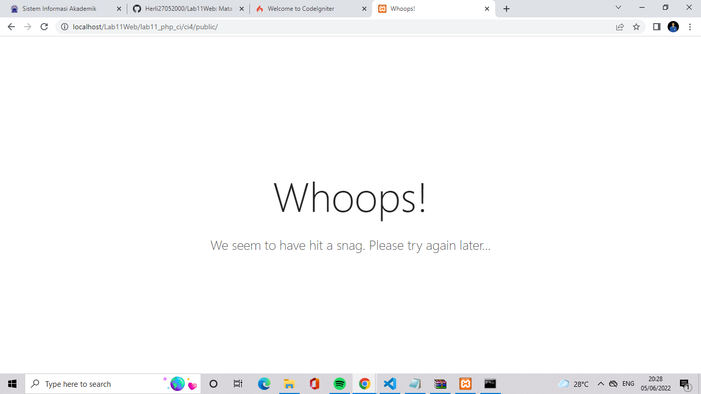
Semua jenis erorr akan ditampilkan sama. Untuk memudahkan mengetahui jenis erorrnya, maka perlu diaktifkan mode debugging dengan mengubah nilai konfigurasi pada environment variable CI_ENVIRONMENT menjadi development.
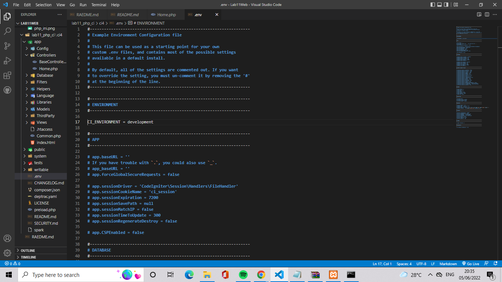
Ubah nama file env menjadi .env kemudian buka file tersebut dan ubah nilai variable CI_ENVIRONMENT menjadi development.
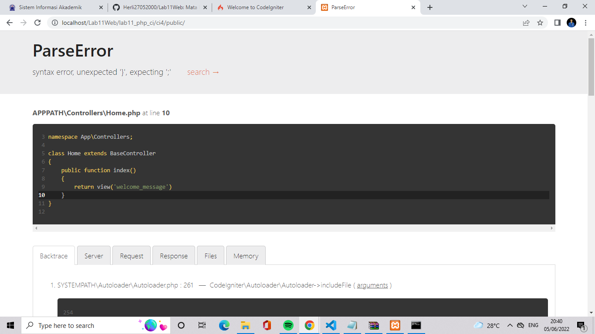
Contoh erorr yang terjadi. Untuk mencoba erorr tersebut, ubah kode pada file app/Controller/Home.php hilangkan titik koma pada akhir kode.
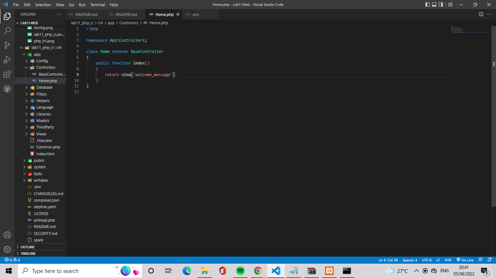
dan akan erorr seperti gambar tampilan browser digambar sebelumnya.

## 7. MEMBUAT ROUTE BARU
Tambahkan kode berikut di dalam Routes.php
``` php
$routes->get('/about', 'Page::about');
$routes->get('/contact', 'Page::contact');
$routes->get('/faqs', 'Page::faqs');
```
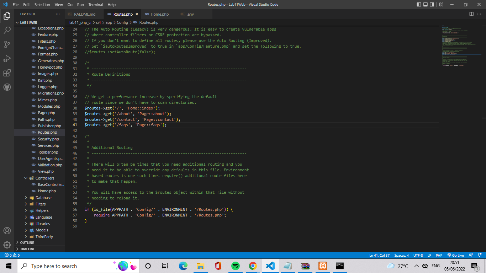
Untuk mengetahui route yang ditambahkan sudah benar, buka CLI dan jalankan perintah berikut.
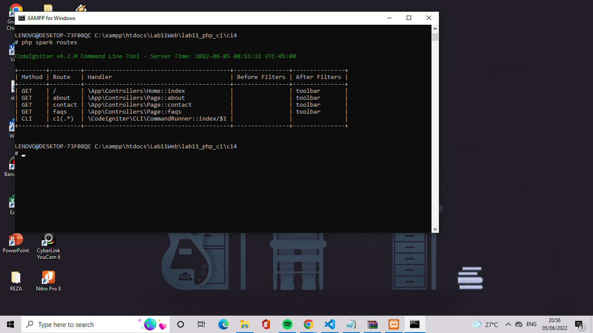
Selanjutnya coba akses route yang telah dibuat dengan mengakses alamat url: http://localhost:8080/about
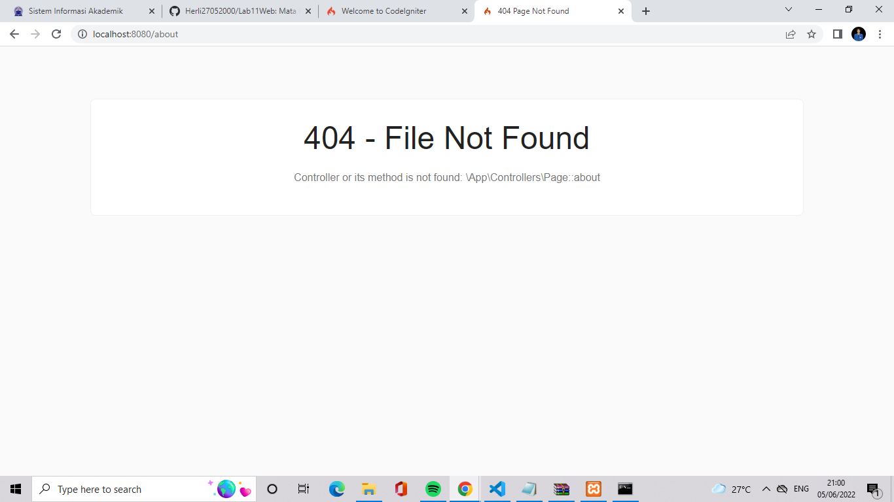
Ketika diakses akan muncul tampilan erorr 404 file not found, itu artinya file/page tersebut tidak ada. Untuk mengakses halaman tersebut, harus dibuat terlebih dahulu Controller yang sesuai dengan routing yang dibuat yaitu Controller Page.

## 8. MEMBUAT CONTROLLER
Selanjutnya adalah membuat Controller Page. Buat file dengan nama page.php pada direktori Controller kemudian isi kodenya seperti berikut.
```php
<?php

namespace App\Controllers;


class Page extends BaseController
{
    public function about()
{
        echo "Ini halaman About";
}
public function contact()
{
        echo "Ini halaman Contact";
}
public function faqs()
{
        echo "Ini halaman FAQ";
    }
}
```
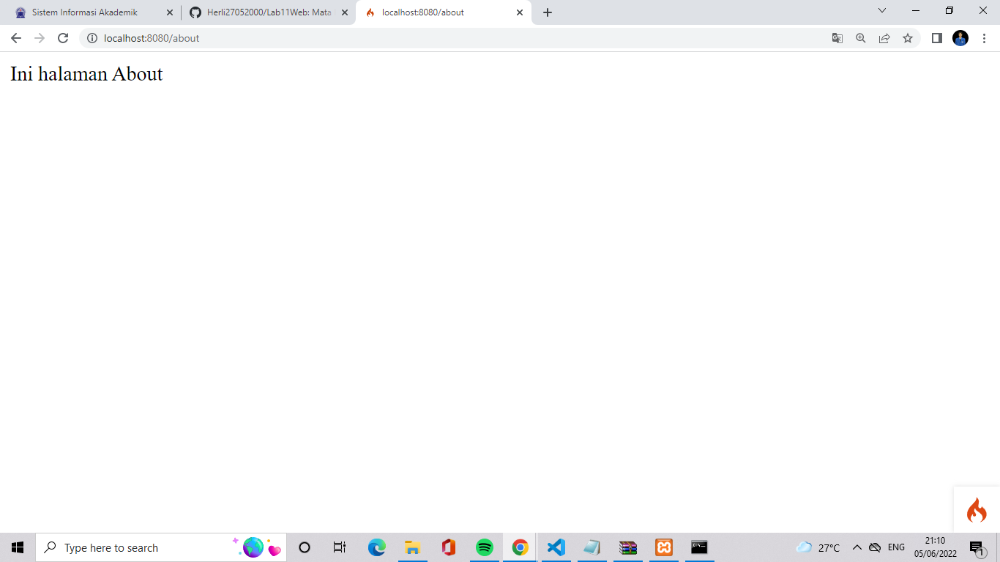
Refresh kembali browser,maka akan ditampilkan hasilnya seperti diatas,dan halaman sudah dapat di akses.

## 9. AUTO ROUTING
Secara default fitur autoroute pada Codeigniter sudah aktif. Untuk mengubah status autoroute dapat mengubah nilai variablenya. Untuk menonaktifkan ubah nilai true menjadi false.

```php
$routes->setAutoRoute(true);
```
Tambahkan method baru pada controller page seperti berikut.

```php
 public function tos()
    {
        echo "ini halaman Term of Services";
    }
```

method ini belum ada pada routing, sehingga cara mengaksesnya dengan menggunakan
alamat:http://localhost:8080/page/tos/

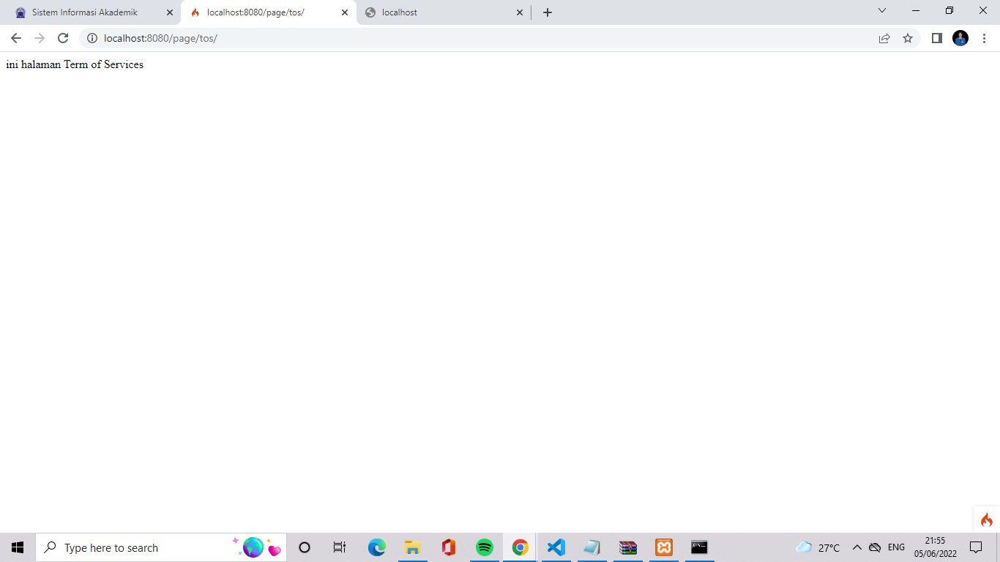

## 10. MEMBUAT VIEWS
Selanjutnya adalah membuat view untuk tampilan web agar lebih menarik. Buat file baru dengan nama about.php pada direktori view (app/view/about.php) kemudian isi kodenya seperti berikut.
```html
<!DOCTYPE html>
<html lang="en">
<head>
    <meta charset="UTF-8">
    <title><?= $title; ?></title>
</head>
<body>
    <h1><?= $title; ?></h1>
    <hr>
    <p><?= $content; ?></p>
</body>
</html>
```
ubah method about pada class controller page menjadi seperti berikut:
```php
public function about()
    {
        return view('about', [
            'title' => 'Halaman About',
            'content' => 'Ini adalah halaman about yang menjelaskan tentang isi
            halaman ini.'
            ]);
    }
```
refresh halaman tersebut
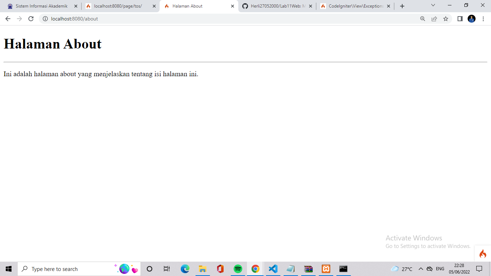

## 11. MEMBUAT LAYOUT WEB DENGAN CSS
Pada dasarnya layout web dengan css dapat diimplementasikan dengan mudah pada codeigniter. Yang perlu diketahui adalah, pada Codeigniter 4 file yang menyimpan asset css dan javascript terletak pada direktori public.

Buat file css pada direktori public dengan nama style.css (copy file dari praktikum lab4_layout) Kita akan gunakan layout yang pernah dibuat pada praktikum 4.
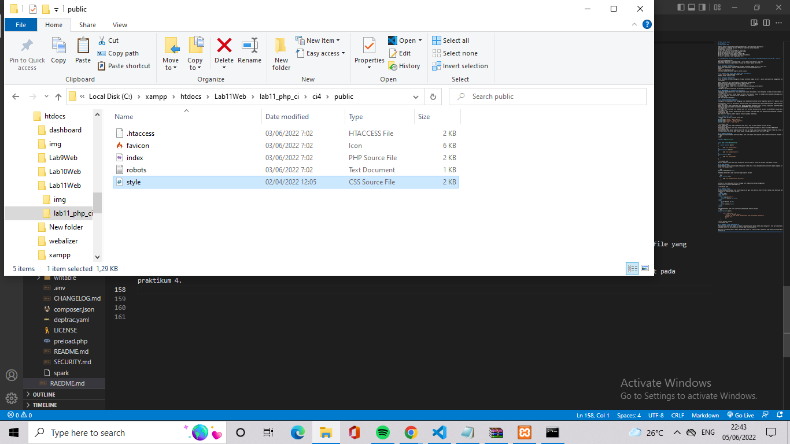

kemudian buat folder templete pada direktori view kemudian buat file header.php dan folder.php
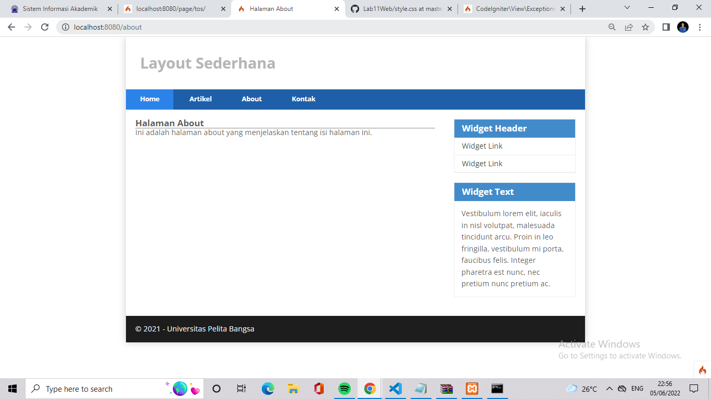

UNTUK PERTEMUAN KALI INI CUKUP SAMPAI DISINI DAN SAMPAI BERTEMU DI PERTEMUAN BERIKUTNYA
TERIMAKASIH