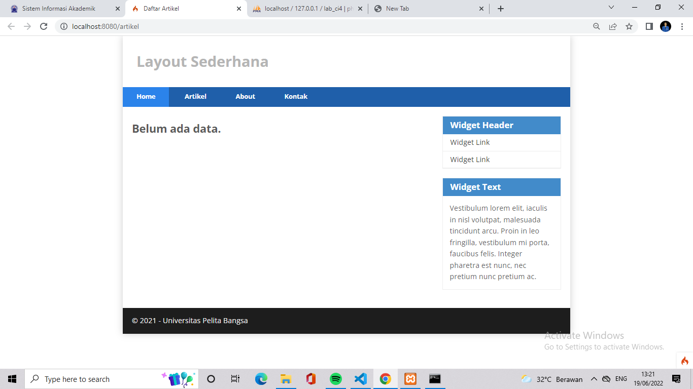
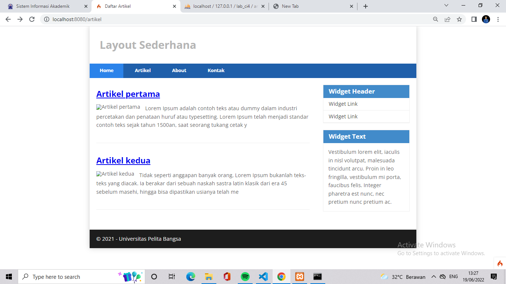
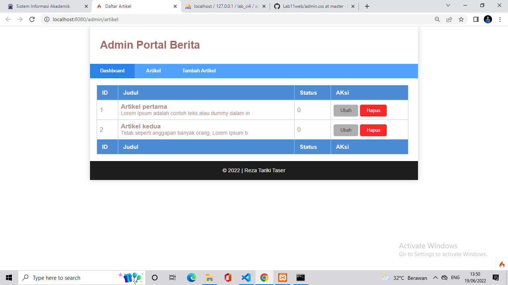
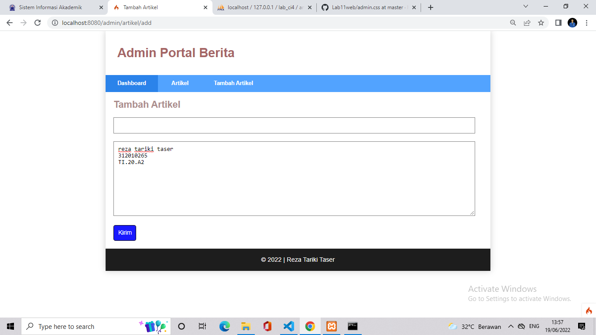
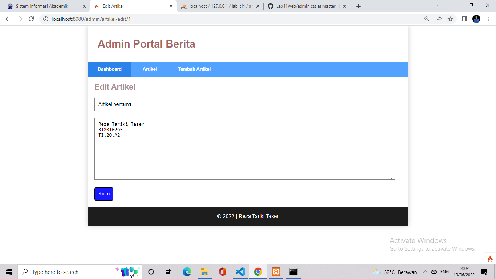

## Reza Tariki Taser
## TI.20.A2
## 312010265
## Pemrograman Web

Sebelum memulai menggunakan Framework Codeigniter, perlu dilakukan konfigurasi
pada webserver. Beberapa ekstensi PHP perlu diaktifkan untuk kebutuhan
pengembangan Codeigniter 4.
Berikut beberapa ekstensi yang perlu diaktifkan:
• php-json ekstension untuk bekerja dengan JSON;
• php-mysqlnd native driver untuk MySQL;
• php-xml ekstension untuk bekerja dengan XML;
• php-intl ekstensi untuk membuat aplikasi multibahasa;
• libcurl (opsional), jika ingin pakai Curl.

## 1.mengaktifkan ekstentsi tersebut, melalu XAMPP Control Panel, pada bagian Apache klik Config -> PHP.ini


Pada bagian extention, hilangkan tanda ; (titik koma) pada ekstensi yang akan
diaktifkan. Kemudian simpan kembali filenya dan restart Apache web server.

## 2. Instalasi Codeigniter 4
Untuk melakukan instalasi Codeigniter 4 dapat dilakukan dengan dua cara, yaitu cara
manual dan menggunakan composer. Pada praktikum ini kita menggunakan cara
manual.

Aktifkan beberpa extension seperti contoh di atas

## 3. KEMUDIAN BUAT FOLDER BARU DENGAN NAMA lab11_php_ci

membuat folder seperti diatas 

## 4. INSTALASI CODEIGNITER 4
Untuk melakukan instalasi codeigniter 4 dapat dilakukan dengan dua cara , yaitu cara manual dan menggunakan composer. pada praktikum ini kita menggunakan cara manual.

Unduh Codeigniter dari website https://codeigniter.com/download
Extrak file zip Codeigniter ke directori htdocs/lab11_ci.
Ubah nama direktory framework-4.x.xx menjadi ci4
Buka browser dengan alamat http://localhost/Lab11Web/lab11_php_ci/ci4/public/

Codeigniter berhasil didownload dan disimpan file ekstrak nya

## 5. MENJALANKAN CLI (Command Line Interface)
Codeigniter 4 menyediakan CLI untuk mempermudah proses development. Untuk mengakses CLI buka terminal/command prompt.

Arahkan lokasi direktori sesuai dengan direktori kerja project dibuat (C:\xampp\htdocs\Lab11Web\lab11_php_ci\ci4)
Perintah yang dapat dijalankan untuk memanggil CLI Codeigniter

php spark berhasil dipanggil

## 6. MENGAKTIFKAN MODE DEBUGGING
Codeigniter 4 menyediakan fitur debugging untuk memudahkan developer untuk mengetahui pesan erorr apabila terjadi kesalahan membuat kode program.

Secara default fitur ini belum aktif. Ketika terjadi erorr pada aplikasi akan ditampilkan pesan seperti berikut.

Semua jenis erorr akan ditampilkan sama. Untuk memudahkan mengetahui jenis erorrnya, maka perlu diaktifkan mode debugging dengan mengubah nilai konfigurasi pada environment variable CI_ENVIRONMENT menjadi development.

Ubah nama file env menjadi .env kemudian buka file tersebut dan ubah nilai variable CI_ENVIRONMENT menjadi development.

Contoh erorr yang terjadi. Untuk mencoba erorr tersebut, ubah kode pada file app/Controller/Home.php hilangkan titik koma pada akhir kode.

dan akan erorr seperti gambar tampilan browser digambar sebelumnya.

## 7. MEMBUAT ROUTE BARU
Tambahkan kode berikut di dalam Routes.php
``` php
$routes->get('/about', 'Page::about');
$routes->get('/contact', 'Page::contact');
$routes->get('/faqs', 'Page::faqs');
```

Untuk mengetahui route yang ditambahkan sudah benar, buka CLI dan jalankan perintah berikut.

Selanjutnya coba akses route yang telah dibuat dengan mengakses alamat url: http://localhost:8080/about

Ketika diakses akan muncul tampilan erorr 404 file not found, itu artinya file/page tersebut tidak ada. Untuk mengakses halaman tersebut, harus dibuat terlebih dahulu Controller yang sesuai dengan routing yang dibuat yaitu Controller Page.

## 8. MEMBUAT CONTROLLER
Selanjutnya adalah membuat Controller Page. Buat file dengan nama page.php pada direktori Controller kemudian isi kodenya seperti berikut.
```php
<?php

namespace App\Controllers;


class Page extends BaseController
{
    public function about()
{
        echo "Ini halaman About";
}
public function contact()
{
        echo "Ini halaman Contact";
}
public function faqs()
{
        echo "Ini halaman FAQ";
    }
}
```

Refresh kembali browser,maka akan ditampilkan hasilnya seperti diatas,dan halaman sudah dapat di akses.

## 9. AUTO ROUTING
Secara default fitur autoroute pada Codeigniter sudah aktif. Untuk mengubah status autoroute dapat mengubah nilai variablenya. Untuk menonaktifkan ubah nilai true menjadi false.

```php
$routes->setAutoRoute(true);
```
Tambahkan method baru pada controller page seperti berikut.

```php
 public function tos()
    {
        echo "ini halaman Term of Services";
    }
```

method ini belum ada pada routing, sehingga cara mengaksesnya dengan menggunakan
alamat:http://localhost:8080/page/tos/


## 10. MEMBUAT VIEWS
Selanjutnya adalah membuat view untuk tampilan web agar lebih menarik. Buat file baru dengan nama about.php pada direktori view (app/view/about.php) kemudian isi kodenya seperti berikut.
```html
<!DOCTYPE html>
<html lang="en">
<head>
    <meta charset="UTF-8">
    <title><?= $title; ?></title>
</head>
<body>
    <h1><?= $title; ?></h1>
    <hr>
    <p><?= $content; ?></p>
</body>
</html>
```
ubah method about pada class controller page menjadi seperti berikut:
```php
public function about()
    {
        return view('about', [
            'title' => 'Halaman About',
            'content' => 'Ini adalah halaman about yang menjelaskan tentang isi
            halaman ini.'
            ]);
    }
```
refresh halaman tersebut


## 11. MEMBUAT LAYOUT WEB DENGAN CSS
Pada dasarnya layout web dengan css dapat diimplementasikan dengan mudah pada codeigniter. Yang perlu diketahui adalah, pada Codeigniter 4 file yang menyimpan asset css dan javascript terletak pada direktori public.

Buat file css pada direktori public dengan nama style.css (copy file dari praktikum lab4_layout) Kita akan gunakan layout yang pernah dibuat pada praktikum 4.


kemudian buat folder templete pada direktori view kemudian buat file header.php dan folder.php


UNTUK PERTEMUAN KALI INI CUKUP SAMPAI DISINI DAN SAMPAI BERTEMU DI PERTEMUAN BERIKUTNYA
TERIMAKASIH.

## Reza Tariki Taser
## TI.20.A2
## 312010265
## Pemrograman Web

Langkah-langkah Praktikum
Persiapan.
Untuk memulai membuat aplikasi CRUD sederhana, yang perlu disiapkan adalah
database server menggunakan MySQL. Pastikan MySQL Server sudah dapat dijalankan
melalui XAMPP.

## Langkah pertama 
Membuat database 
```mysql
CREATE DATABASE lab_ci4;
```

## Langkah kedua 
Membuat Tabel
```mysql
CREATE TABLE artikel (
id INT(11) auto_increment,
judul VARCHAR(200) NOT NULL,
isi TEXT,
gambar VARCHAR(200),
status TINYINT(1) DEFAULT 0,
slug VARCHAR(200),
PRIMARY KEY(id)
);
```
## Langkah ketiga
Konfigurasi koneksi database
Selanjutnya membuat konfigurasi untuk menghubungkan dengan database server.
Konfigurasi dapat dilakukan dengan du acara, yaitu pada file app/config/database.php
atau menggunakan file .env. Pada praktikum ini kita gunakan konfigurasi pada file .env.
```
 database.default.hostname = localhost
 database.default.database = lab_ci4
 database.default.username = root
 database.default.password = 
 database.default.DBDriver = MySQLi
 database.default.DBPrefix =
```
## Langkah keempat
Membuat Model
Selanjutnya adalah membuat Model untuk memproses data Artikel. Buat file baru pada
direktori app/Models dengan nama ArtikelModel.php
```php

```

## Langkah kelima
Membuat Controller
Buat Controller baru dengan nama Artikel.php pada direktori app/Controllers.
```php
<?php
namespace App\Controllers;
use App\Models\ArtikelModel;
class Artikel extends BaseController
{
public function index()
{
    $title = 'Daftar Artikel';
$model = new ArtikelModel();
$artikel = $model->findAll();
return view('artikel/index', compact('artikel', 'title'));
}
}
```
## Langkah keenam
Membuat View
Buat direktori baru dengan nama artikel pada direktori app/views, kemudian buat file
baru dengan nama index.php.

```php
<?= $this->include('template/header'); ?>
<?php if($artikel): foreach($artikel as $row): ?>
<article class="entry">
<h2<a href="<?= base_url('/artikel/' . $row['slug']);?>"><?=
$row['judul']; ?></a>
</h2>
" alt="<?=
$row['judul']; ?>">
<p><?= substr($row['isi'], 0, 200); ?></p>
</article>
<hr class="divider" />
<?php endforeach; else: ?>
<article class="entry">
<h2>Belum ada data.</h2>
</article>
<?php endif; ?>
<?= $this->include('template/footer'); ?>
```
Belum ada data yang diampilkan. Kemudian coba tambahkan beberapa data pada
database agar dapat ditampilkan datanya.


## Langkah ketujuh
Membuat Tampilan Detail Artikel
Tampilan pada saat judul berita di klik maka akan diarahkan ke halaman yang berbeda.
Tambahkan fungsi baru pada Controller Artikel dengan nama view().
```php
public function view($slug)
{
$model = new ArtikelModel();
$artikel = $model->where([
'slug' => $slug
])->first();
// Menampilkan error apabila data tidak ada.
if (!$artikel)
{
    throw PageNotFoundException::forPageNotFound();
}
$title = $artikel['judul'];
return view('artikel/detail', compact('artikel', 'title'));
}
```

## Langkah kedelapan
Membuat View Detail
Buat view baru untuk halaman detail dengan nama app/views/artikel/detail.php.
```php

```

## Langkah kesembilan
Membuat Routing untuk artikel detail
Buka Kembali file app/config/Routes.php, kemudian tambahkan routing untuk artikel
detail.
```php
$routes->get('/artikel/(:any)', 'Artikel::view/$1');
```


## Langkah kesepuluh
Membuat Menu Admin
Menu admin adalah untuk proses CRUD data artikel. Buat method baru pada
Controller Artikel dengan nama admin_index().

```php
public function admin_index()
{
$title = 'Daftar Artikel';
$model = new ArtikelModel();
$artikel = $model->findAll();
return view('artikel/admin_index', compact('artikel', 'title'));
}
```

Selanjutnya buat view untuk tampilan admin dengan nama admin_index.php
```php
<?= $this->include('template/admin_header'); ?>
<table class="table">
<thead>
<tr>
<th>ID</th>
<th>Judul</th>
<th>Status</th>
<th>AKsi</th>
</tr>
</thead>
<tbody>
<?php if($artikel): foreach($artikel as $row): ?>
<tr>
<td><?= $row['id']; ?></td>
<td>
<b><?= $row['judul']; ?></b>
<p><small><?= substr($row['isi'], 0, 50); ?></small></p>
</td>
<td><?= $row['status']; ?></td>
<td>
<a class="btn" href="<?= base_url('/admin/artikel/edit/' .
$row['id']);?>">Ubah</a>
<a class="btn btn-danger" onclick="return confirm('Yakin
menghapus data?');" href="<?= base_url('/admin/artikel/delete/' .
$row['id']);?>">Hapus</a>
</td>
</tr>
<?php endforeach; else: ?>
<tr>
<td colspan="4">Belum ada data.</td>
</tr>
<?php endif; ?>
</tbody>
<tfoot>
<tr>
<th>ID</th>
<th>Judul</th>
<th>Status</th>
<th>AKsi</th>
</tr>
</tfoot>
</table>
<?= $this->include('template/admin_footer'); ?>
```
Tambahkan routing untuk menu admin seperti berikut:
```php
$routes->group('admin', function($routes) {
$routes->get('artikel', 'Artikel::admin_index');
$routes->add('artikel/add', 'Artikel::add');
$routes->add('artikel/edit/(:any)', 'Artikel::edit/$1');
$routes->get('artikel/delete/(:any)', 'Artikel::delete/$1');
});
```


## Langkah kesebelas
Menambah Data Artikel
Tambahkan fungsi/method baru pada Controller Artikel dengan nama add().
```php
public function add()
{
// validasi data.
$validation = \Config\Services::validation();
$validation->setRules(['judul' => 'required']);
$isDataValid = $validation->withRequest($this->request)->run();
if ($isDataValid)
{
$artikel = new ArtikelModel();
$artikel->insert([
'judul' => $this->request->getPost('judul'),
'isi' => $this->request->getPost('isi'),
'slug' => url_title($this->request->getPost('judul')),
]);
return redirect('admin/artikel');
}
$title = "Tambah Artikel";
return view('artikel/form_add', compact('title'));
}
```
Kemudian buat view untuk form tambah dengan nama form_add.php
```php
<?= $this->include('template/admin_header'); ?>
<h2><?= $title; ?></h2>
<form action="" method="post">
<p>
<input type="text" name="judul">
</p>
<p>
<textarea name="isi" cols="50" rows="10"></textarea>
</p>
<p><input type="submit" value="Kirim" class="btn btn-large"></p>
</form>
<?= $this->include('template/admin_footer'); ?>
```


## Langkah keduabelas
Mengubah Data
Tambahkan fungsi/method baru pada Controller Artikel dengan nama edit().
```php
public function edit($id)
{
$artikel = new ArtikelModel();
// validasi data.
$validation = \Config\Services::validation();
$validation->setRules(['judul' => 'required']);
$isDataValid = $validation->withRequest($this->request)->run();
if ($isDataValid)
{
$artikel->update($id, [
'judul' => $this->request->getPost('judul'),
'isi' => $this->request->getPost('isi'),
]);
return redirect('admin/artikel');
}
// ambil data lama
$data = $artikel->where('id', $id)->first();
$title = "Edit Artikel";
return view('artikel/form_edit', compact('title', 'data'));
}
```
Kemudian buat view untuk form tambah dengan nama form_edit.php
```php
<?= $this->include('template/admin_header'); ?>
<h2><?= $title; ?></h2>
<form action="" method="post">
<p>
<input type="text" name="judul" value="<?= $data['judul'];?>" >
</p>
<p>
<textarea name="isi" cols="50" rows="10"><?=
$data['isi'];?></textarea>
</p>
<p><input type="submit" value="Kirim" class="btn btn-large"></p>
</form>
<?= $this->include('template/admin_footer'); ?>
```


## Langkah ketigabelas
Menghapus Data
Tambahkan fungsi/method baru pada Controller Artikel dengan nama delete().
```php
public function delete($id)
{
$artikel = new ArtikelModel();
$artikel->delete($id);
return redirect('admin/artikel');
}
```

